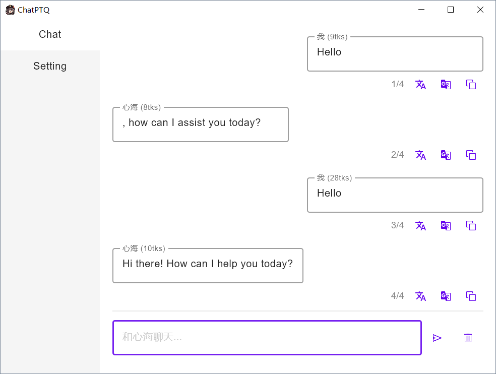

# ChatPTQ
 - A (Windows) desktop ChatGPT app for personal quick use
 - Compose Desktop App
 - [个人主页](https://juejin.cn/user/800859313671719)

---

## Usage

[exe下载](launcher/ChatPTQ.rar)

* Windows应用，无需安装，开箱即用
* 使用前先在Setting里配置
* 仅为个人私用，安全、高效、方便
* ~~MacOS我没有试过，我没有Mac，想用的话可以自己拉项目打包mac版的试试~~

## Setting

* GPT昵称：对话的昵称
* 代理设置：
  * 暂不支持自动系统代理，只能手动填入系统代理，具体在`设置-网络和Internet-代理-手动设置代理`中可以找到ip和端口
* 请求设置：
  * 自行填入ApiKey
* 开机启动
  * 暂不支持

## Chat

* 发送消息：发送图标
  * 快捷发送：长按Enter0.5秒
* 清屏：垃圾桶图标
  * 请注意聊天长度，上下文记忆需要回传所有历史聊天消息，因此发的请求越多token花费越多，请自行把控token的消耗，程序并未设限

## Project

* 打exe包（不带安装文件）：执行compose desktop下的CreateDistributable Task
  * 注意build.gradle.kts中application下javaHome改成自己的JDK路径，好像需要15以上，没有的话可以去下载一个，javaHome路径直接指过去就行了
  * 生成的exe包在build/compose/binaries/main下
* 运行：直接运行Main.kt
* **注意：不要把自己的ApiKey传到公网（例如github）上，会导致封号**

